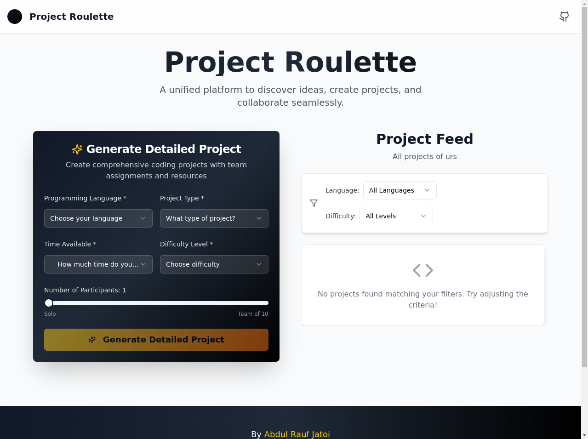
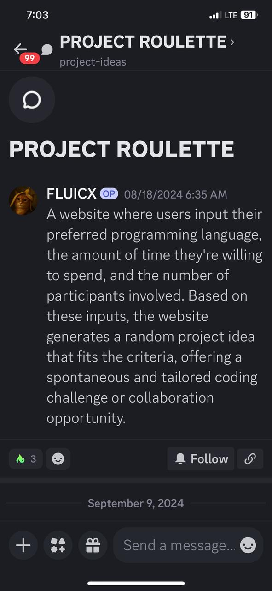

# Project Roulette

## Overview

Project Roulette is a dynamic web application designed to spark creativity and kickstart development by providing users with tailored project ideas. It serves as a unified platform where developers, whether solo or in teams, can discover comprehensive coding projects complete with team assignments and resources, all generated based on their specific preferences and constraints. Simply select your desired programming language, project type, available time, difficulty level, and team size, and let Project Roulette spin the wheel to find your next exciting challenge!

The user interface is clean and intuitive, allowing for seamless navigation and interaction. The core functionality revolves around the "Generate Detailed Project" feature, which takes user inputs and leverages a powerful language model to create unique and relevant project suggestions.

## Features

Project Roulette offers several features to help users find their ideal coding project:

*   **Customizable Project Generation:** Users can fine-tune their search using specific criteria, including Programming Language (options range from JavaScript, Python, Java to niche languages, or simply 'Any Language'), Project Type (covering Web Applications, Mobile Apps, Games, APIs, Data Analysis, Machine Learning, and more), Time Available (from quick 30-minute tasks to week-long projects), Difficulty Level (Beginner, Intermediate, Advanced, Expert), and the Number of Participants (scaling from solo developers to teams of up to 10).
*   **Detailed Project Descriptions:** Leveraging the power of the Groq LLM, the application aims to generate not just project titles but comprehensive descriptions, potentially including suggested tasks, assignments, and relevant resources to get started.
*   **Project Feed:** A dedicated section is designed to display a feed of generated projects based on selected filters, allowing users to browse through various ideas. Currently, it prompts users to adjust criteria if no matching projects are found initially.
*   **Responsive Design:** Built with React and Tailwind CSS, the application ensures a smooth and visually consistent experience across different devices and screen sizes.

## Tech Stack

Project Roulette is built using a modern and efficient technology stack chosen for performance and developer experience:

*   **Frontend Framework:** [React](https://reactjs.org/) combined with [Vite](https://vitejs.dev/) provides a fast development server and optimized builds for a highly responsive user interface.
*   **Styling:** [Tailwind CSS](https://tailwindcss.com/) is used for its utility-first approach, enabling rapid development and easy customization of the visual design.
*   **Language Model:** The core project generation logic is powered by [Groq](https://groq.com/), specifically utilizing the `compound-beta` model to process user inputs and generate creative and relevant project ideas.

> [!NOTE]
> Currently, Project Roulette operates primarily on the frontend, generating project ideas on-the-fly without a persistent backend database. While this keeps the application lightweight, future development might explore integrating a solution like SQLite to store generated projects, user preferences, or team collaboration features.

## Inspiration & Acknowledgements

The initial concept for Project Roulette was inspired by a creative project idea shared by a fellow user within a random Discord community. Their suggestion highlighted the common challenge developers face in finding new and interesting projects, which directly led to the development of this tool.

I extend a sincere thank you to that anonymous Discord user whose idea served as the catalyst for Project Roulette!

> [!WARNING]
> The project ideas generated by Project Roulette are created by an AI language model (Groq). While designed to be helpful, users should always review the suggested scope, feasibility, and requirements before committing to development. Treat the generated ideas as starting points or inspiration.

## Author

This project was conceived and developed by **Abdul Rauf Jatoi**.

---

*Thank you for checking out Project Roulette! I hope it helps you find your next exciting coding adventure. Feel free to explore the application and generate some ideas!*
